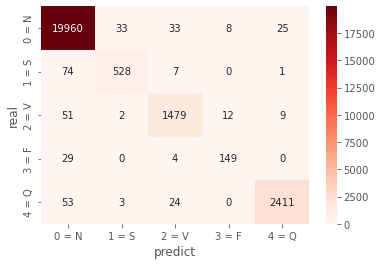

# Arrhythmia detection based on ECG Signal by Spectrogram Image using 2D Deep CNN
- 참고 논문 : [ECG Arrhythmia Classification Using STFT-Based Spectrogram and Convolutional Neural Network](https://ieeexplore.ieee.org/document/8759878)

ECG Database를 Spectrogram으로 변환하여 2D CNN에 넣어 Classification을 진행하는 모델이다. 모델의 구조나 전처리 방법을 참고하여 진행하였다. 본 프로젝트는 [ECG Arrythmia classification using 2D CNN with 2D Image](https://github.com/insung3511/2d_cnn_ecg) 와 동시에 진행되는 프로젝트이다. 빠른 진행을 위해 Tensorflow을 활용하는 중이다.

## 전처리 방식
- Data Download link 
    - mit_data.zip [MIT data directory download link](https://drive.google.com/file/d/1Hm9ZHp1s6h_JEYHIMH_4bQUWLCf67-F4/view?usp=sharing)
    - spectrogram_zip [Spectrogram Graph image download link](https://drive.google.com/file/d/1Lv42peuj7lKCp2z8AVjA5IdF3y7SVjfM/view?usp=sharing)

STFT 를 이용해 Spectrogram 을 만들어줘야 하기 때문에 전처리 과정은 필수이다. 다만 논문에서는 10초 단위로 나뉘어 전처리를 해주었지만 해당 코드는 비트별로 전처리를 한다. 논문에서 제시한 전체적인 흐름은 다음과 같다. 


여기서 ECG Original Signal 부분은 이전에 [ecg-rr](https://github.com/insung3511/ecg-rr) 에서 진행을 하였기 때문에 따로 또 해주진 않았다. ECG Signal Data 부터 진행해야하는데 각 비트를 모두 STFT 를 통과시켜 Spectrogram 형태로 그려주는 것이다. 

## Model 구성
논문에서 모델의 입력값은 256 * 256 으로 하였다. 아직 모델 파트 까지는 가지 못해 나도 아직 정확한 입력값의 크기를 정하진 못했지만 아무튼 일단 그렇게 할거 같다. 구조는 아래와 같다.


논문에서도 총 5개의 클래스로 분류하기 떼문에 해당 논문에서 크게 다른 점이라면 전처리 과정 외에는 아직 큰 변화가 없을 것으로 예상된다.

# Reuslt
## Accuracy & Loss


## Confusion Matrix


```
              precision    recall  f1-score   support

       0 = N       0.99      0.99      0.99     20059
       1 = S       0.94      0.87      0.91       610
       2 = V       0.96      0.95      0.95      1553
       3 = F       0.85      0.68      0.76       182
       4 = Q       0.98      0.98      0.98      2491

    accuracy                           0.99     24895
   macro avg       0.94      0.90      0.92     24895
weighted avg       0.98      0.99      0.99     24895
```

# Result
해당 결과는 Spectrogram을 넣었던 모델에 Raw graph Image를 입력으로 넣은 결과 값이다.

## Accuracy & Loss


## Confusion Matrix




```
             precision    recall  f1-score   support

       0 = N       0.99      1.00      0.99     20059
       1 = S       0.93      0.87      0.90       610
       2 = V       0.96      0.95      0.95      1553
       3 = F       0.88      0.82      0.85       182
       4 = Q       0.99      0.97      0.98      2491

    accuracy                           0.99     24895
   macro avg       0.95      0.92      0.93     24895
weighted avg       0.99      0.99      0.99     24895
```